<p align="center">
  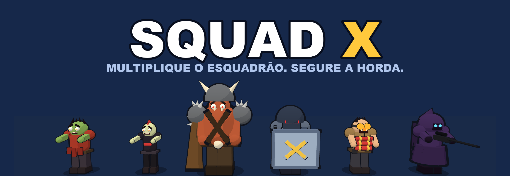
</p>

<p align="center">
  <b>Um esquadrão, uma pista e muita gente querendo te parar.</b><br>
  Corra, atire sozinho, escolha o portal certo e segure a horda até o chefão. Jogo de celular em 3D, direto no navegador.
</p>

<p align="center">
  <a href="https://squad-x-web-inky.vercel.app"><b>▶️ Jogar agora: squad-x-web-inky.vercel.app</b></a><br>
  <sub>Abra no celular, em pé. Dá para instalar como app e jogar sem internet.</sub>
</p>

<p align="center">
  
  
  
  
  
  
  
  
  <a href="https://squad-x-web-inky.vercel.app"></a>
  <a href="LICENSE"></a>
</p>

<p align="center">
  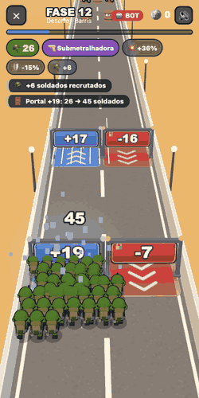
  <br>
  <sub>Gravado no jogo: um bot jogando a fase 12 (deserto). Repare no <code>+22</code> azul à esquerda e no <code>-16</code> vermelho com cadeado à direita.</sub>
</p>

## 🪖 Que jogo é esse?

Sabe aquele anúncio de celular em que um soldadinho corre por uma ponte, passa por um portal `×4` e vira um exército? Aqui ele é um jogo de verdade, e com as decisões que o anúncio nunca mostra.

Você arrasta o dedo para mover o esquadrão. Ele atira sozinho. O resto é escolher: qual portal tomar, qual barril abrir primeiro, para onde desviar quando o avião marca a pista com vermelho, e quanto do dinheiro gastar na loja antes da próxima fase.

Tudo é original: cada soldado, monstro, arma e som sai de código. Nenhum modelo ou arquivo de áudio foi copiado.

## 🚪 O que tem na pista

- **Portais:** `+N` e `×N` ajudam, `-N` e `÷N` machucam. Os vermelhos com cadeado não dá para consertar a tiros; só existe um tipo de vermelho "bombeável", e só vale a pena com poder de fogo de sobra.
- **Barris:** quebram em arma nova, veículo, soldados ou moedas. O barril na sua frente recebe o tiro até quebrar, então a ordem importa.
- **Hordas:** zumbis, velocistas, brutamontes, policiais de choque (o tiro de soldado rende menos neles), homens-bomba (explodem em cadeia) e atiradores (recuam e atiram).
- **Chefões:** cinco, um por mundo, e cada um luta de um jeito: mísseis, barris explosivos rolando, escudo com laser, gelo com pancada e chuva de meteoros. Ficam parados na pista, visíveis de longe, e a barra de vida no topo mostra quanto falta.
- **Perigos:** espinhos para desviar, minas para atirar de longe e, a partir da fase 6, um **bombardeiro** que deixa um corredor seguro entre as zonas vermelhas.
- **Loja:** Dano, Reforços, Resistência e Butim. A campanha inteira é calibrada em volta dela (veja [Dificuldade](#-dificuldade-amarrada-à-loja)). Duas vezes na campanha dá para devolver Dano, Reforços e Resistência, receber de volta tudo o que foi gasto neles e comprar de novo (o Butim fica).

## 👥 O elenco

### O esquadrão

Visto de costas, que é como você o enxerga no jogo: capacete grande com aba, colete com placas, mochila com rolo de dormir, pá e cantil. Conforme o grupo cresce, os soldados diminuem e se apertam para o bloco não cobrir a pista; até 180 aparecem na tela, e o número em cima do grupo mostra o total real.

<p align="center">
  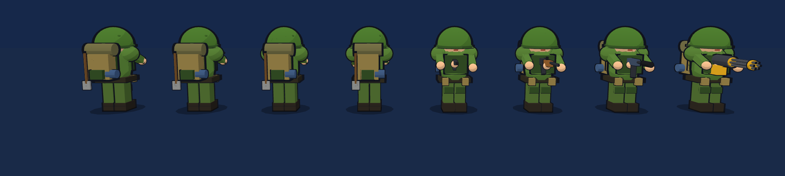
</p>

### A horda

Cada tipo tem rosto, silhueta e jeito de correr próprios, e só entra numa fase quando o esquadrão esperado aguenta enfrentá-lo.

<p align="center">
  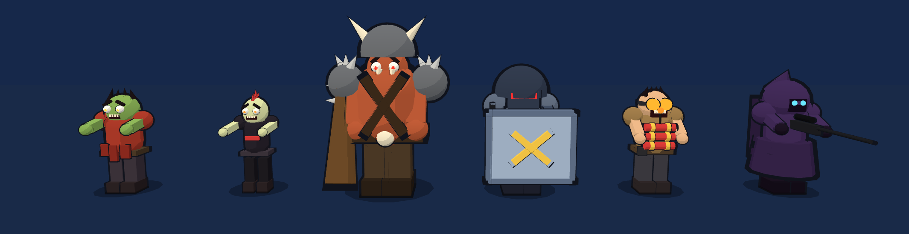
</p>

| Inimigo | Chega no mundo | Vida | Como é |
|---|---|---|---|
| Zumbi | 1 | 6 | Corre em bando, camisa rasgada |
| Velocista | 2 | 4 | O dobro da velocidade do zumbi |
| Brutamonte | 1 | 40 | Porrete e ombreiras de espinhos; leva 4 soldados ao encostar |
| Policial de choque | 2 | 34 | Escudo: soldados rendem 45%. Tanque e helicóptero ignoram |
| Homem-bomba | 3 | 9 | Dinamite no peito; morto de longe, leva os vizinhos junto |
| Atirador | 4 | 14 | Para a 16 unidades, atira a cada 1,3 s e recua se você chega perto |

### Os chefões

<p align="center">
  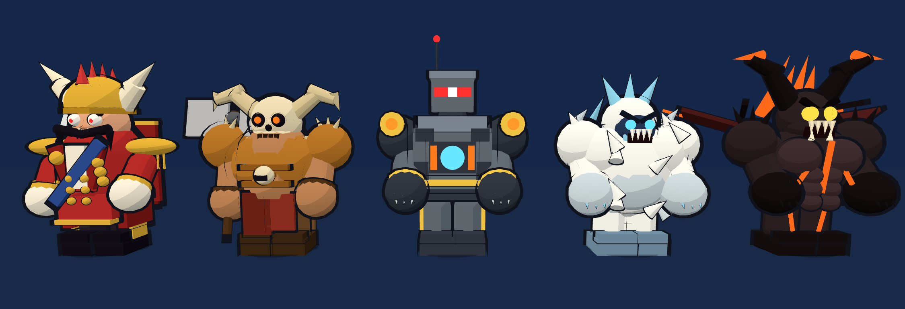
</p>

Um por mundo, nas fases 5 e 10. O esquadrão para a 14 unidades deles e só segue quando morrem. Cada um ataca do seu jeito, e tudo o que ele lança é avisado antes, com um jeito de escapar:

| Chefão | Mundo | Ataque | Como enfrentar | Lacaios |
|---|---|---|---|---|
| General | Ponte | Mísseis na sua faixa, um de cada vez, com a mira marcada no chão (um atrás do outro quando furioso) | Derrube no ar com as colunas embaixo dele, ou saia da mira | Zumbis |
| Senhor da Guerra | Deserto | Uma fileira de barris explosivos rolando, com uma faixa livre | Vá para a faixa livre ou abra caminho a tiros. Os barris também protegem o chefão | Velocistas |
| Mecha | Cidade | Escudo de energia com uma brecha que muda de lugar, e laser na brecha | Atire pela brecha (a faixa verde) e saia dela quando o laser marcar | Policiais de choque |
| Yeti | Neve | Sopro de gelo e, logo em seguida, a pancada | Saia do azul: quem congela para de atirar e o esquadrão anda devagar | Brutamontes |
| Demônio | Vulcão | Meteoros em todos os lugares menos um, e o chão pega fogo onde caem | Ache o lugar livre e fique fora das chamas | Homens-bomba |

<p align="center">
  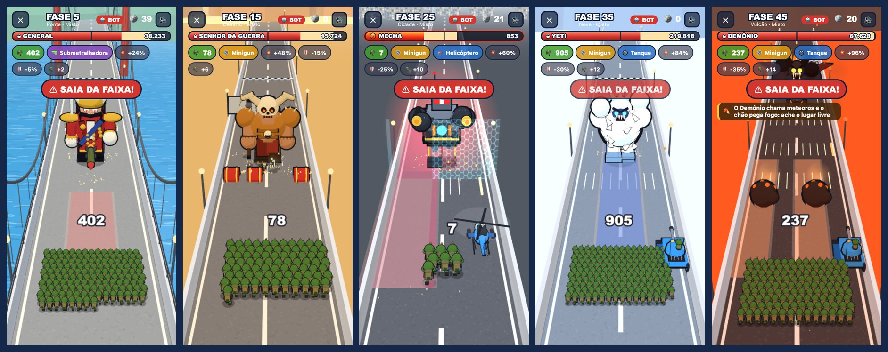
  <br>
  <sub>Gravado no jogo, com o bot jogando: a mira do míssil, a fileira de barris com a faixa livre, a brecha verde e o laser, o gelo azul e os meteoros caindo.</sub>
</p>

Abaixo da metade da vida o chefão fica **furioso** (aura vermelha, ataques mais rápidos), e os lacaios vêm em ondas cada vez maiores: enrolar é perder. A vida dele é medida em segundos de tiro do esquadrão que um jogador típico leva até ali (12 s, ou 18 s no chefão que fecha o mundo), então nenhum cai num instante e nenhum dura minutos. Na prática, a luta leva de uns 10 a uns 60 segundos.

Quando o chefão entra em vista, a barra de progresso vira a barra de vida dele, com o nome, o número e a marca da fúria. A parte vermelha cai na hora e um rastro claro vai atrás, então dá para ver quanto cada rajada tirou. Ao acordar, ele avisa o que faz.

### Armas e veículos

<p align="center">
  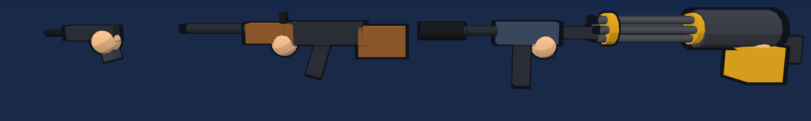
</p>

Uma arma melhor troca a de **todos** os soldados. Os veículos correm ao lado do esquadrão, até quatro, cada um com um soldado dentro, e atiram na própria faixa mesmo que só reste um soldado.

<p align="center">
  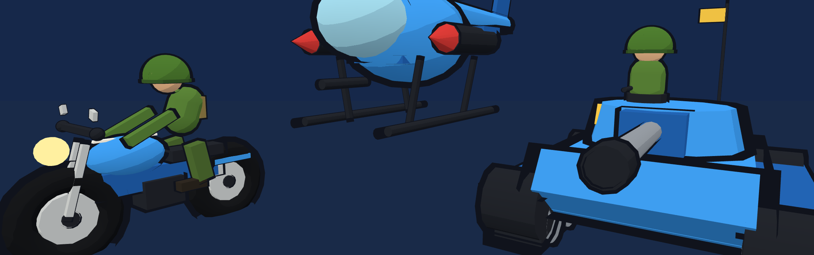
</p>

### Perigos

<p align="center">
  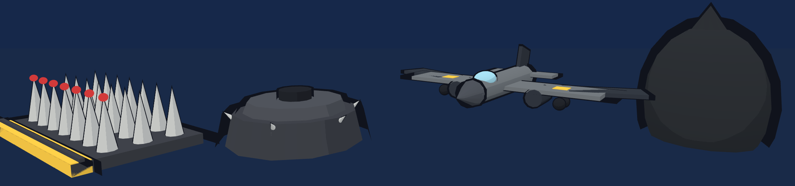
</p>

| Perigo | Como evitar | Custo se pegar |
|---|---|---|
| Espinhos | Mudar de faixa (não dá para atirar) | 40% dos soldados nas colunas sobre eles |
| Mina | Atirar de longe (14 de vida) ou desviar | 60% dos soldados num raio de 1,7 |
| Bombardeiro | Ficar no corredor sem vermelho; 1,6 s de aviso | 30% dos soldados dentro de cada bomba, em 2 ou 3 passadas |

Esquadrão pequeno desvia melhor; esquadrão grande aguenta mais. Cada colisão tira uma fração dos soldados das **colunas** atingidas, não de todos.

## 🌍 Cinco mundos, cinquenta fases

<p align="center">
  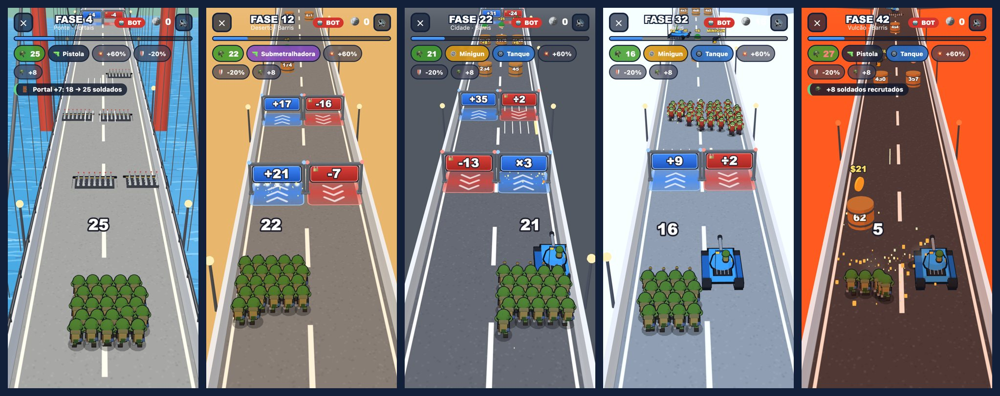
  <br>
  <sub>Ponte pênsil com água animada, deserto de cactos, cidade de janelas acesas, neve caindo na frente da câmera e vulcão com brasas.</sub>
</p>

Cada mundo tem dez fases, com um chefão na 5 e na 10. As fases alternam entre **Portais**, **Barris** e **Misto**, e cada uma tem uma característica própria: Enxame, Elite, Emboscada, Escassez, Correria ou Armadilhas. O aviso aparece ao começar. Cada fase leva de uns 45 a 75 segundos de pista.

## 🎚️ Dificuldade amarrada à loja

O jogo é feito para quem **insiste e evolui**: passa a fase 1 e a 2, trava na 3 até comprar algo, e daí em diante cada fase costuma pedir algumas tentativas.

- **Moedas:** a derrota não paga nada. A primeira vitória numa fase paga a recompensa dela, as estrelas e o saque dos barris. Vencer a mesma fase de novo paga 50%, depois 25%, depois nada; estrela nova (fazer melhor que antes) paga 25 🪙 sempre. Quem trava volta a fases já vencidas para juntar o que elas ainda rendem.
- Um jogador "típico" define o que cada fase espera do esquadrão: duas estrelas por fase e, da fase 3 em diante, uma fase anterior vencida de novo antes de cada nova, gastando tudo na loja.
- Cada fase é calibrada **jogando-a com bots** (8 partidas por tentativa de pressão) para ser a mais difícil em que esse jogador ainda vence **metade das tentativas** (um terço no chefão que fecha o mundo) e, da fase 3 em diante, **não** vencível sem a loja. As fases 1 e 2 são gentis.
- Os números medidos nas 30 primeiras fases: com tudo o que esse jogador comprou, o bot bom vence ~60% de primeira (e perde soldados em 89% das vitórias); sem a loja, ~7%; o bot que não se mexe, ~3%.
- **Teste de estresse:** um bot joga a campanha inteira como uma pessoa: compra na loja, repete a fase quando perde e, quando a próxima melhoria não cabe no bolso, volta a fases já vencidas para juntar moedas. O bot bom termina as 50 fases em **~220 partidas** (umas 110 tentativas e 110 voltas a fases antigas, perto de 4,5 por fase; as mais duras pedem de 9 a 14 tentativas). O bot médio, que erra um terço dos portais e não desvia de nada, para entre as fases 10 e 14: dali em diante o jogo pede quem aprende. `bun run stress` mostra fase a fase.

<p align="center">
  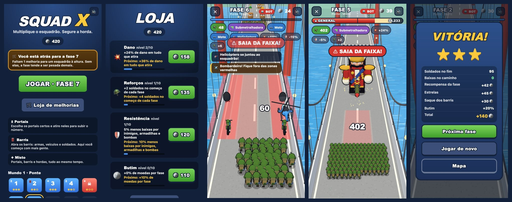
  <br>
  <sub>Menu avisando que você está atrás para a fase 7 · loja · bombardeio · o míssil do General, com a mira marcada no chão · relatório da fase.</sub>
</p>

A tela sempre diz o que você tem (soldados, arma, veículos, melhorias), o que acabou de acontecer (portal, barril, armadilha, bomba) e, na luta, quanta vida o chefão ainda tem. O relatório da fase mostra de onde veio cada moeda e o que derrubou o esquadrão.

## ⚙️ Por dentro

| Camada | O que usa |
|---|---|
| Linguagem | TypeScript `strict` e ESM, num monorepo de Bun workspaces |
| Regras do jogo | `packages/engine`: TypeScript puro e determinístico, sem DOM |
| Cliente | React 19 + Vite 7 para as telas e o HUD; a partida é desenhada em Three.js |
| Arte | Montada por código a partir de formas simples, com sombreamento "toon" e contorno preto |
| Som | Sintetizado em tempo real com Web Audio, sem nenhum arquivo de áudio: efeitos em camadas com eco de sala, e uma música para o menu, outra para a fase e outra para o chefão |
| Instalação | PWA: manifesto e service worker (`vite-plugin-pwa`); depois da primeira visita, joga sem internet |
| Fases | Geradas por semente e calibradas por simulação (`bun run calibrate`) |
| Testes | `bun test`: 108 testes, incluindo cada chefão, o equilíbrio das fases com e sem loja e a campanha inteira jogada por bots |

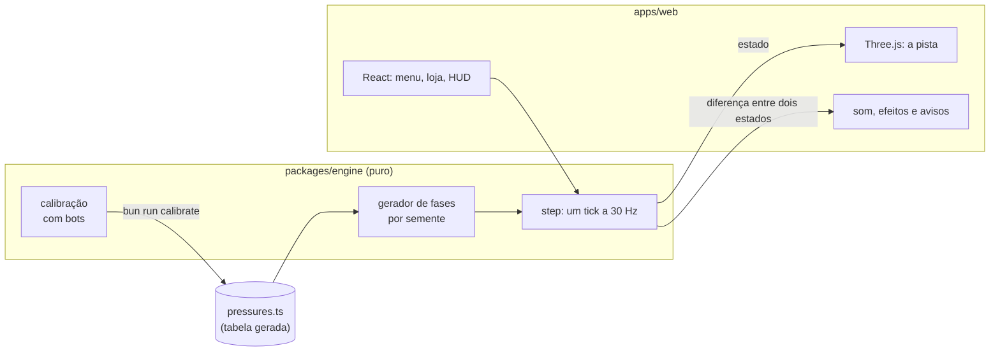

Algumas escolhas que fazem diferença:

- **A engine não conhece o desenho.** Sons, partículas, tremor e os avisos na tela saem da diferença entre dois estados. Trocar o visual não mexe nas regras nem nos testes.
- **Determinismo.** Nada de `Math.random()` nas regras: o acaso vem de um gerador com semente, então todo bug vira um teste que se repete.
- **Muitos bonecos, poucas chamadas de desenho.** Centenas de soldados e inimigos saem de `InstancedMesh`, com as peças de mesma cor fundidas e um contorno por trás.
- **Detalhe na medida do tamanho na tela.** Na partida, cada forma redonda tem só os lados que a deixam a menos de um pixel da curva, o soldado não leva o que só aparece de frente, e o esquadrão grande usa um soldado mais leve. Se mesmo assim o aparelho não acompanha, a imagem fica um pouco mais suave em vez de o jogo ficar lento.
- **Fase dimensionada pelo esquadrão medido.** Um bot joga a fase, e o quanto o esquadrão cresce a cada metro da pista dimensiona hordas, barris e números dos portais. Antes o gerador chutava, e errava por muito.
- **Nada de simulação no celular.** O resultado da calibração fica numa tabela gerada.

Detalhes em [docs/ARCHITECTURE.md](docs/ARCHITECTURE.md) (como funciona), [docs/DECISIONS.md](docs/DECISIONS.md) (por quê) e [docs/ROADMAP.md](docs/ROADMAP.md) (o que vem por aí). A folha de referência visual de todos os personagens e telas está em [docs/design-system.html](docs/design-system.html): baixe e abra no navegador.

## 🕹️ Controles

| Ação | Teclado | Celular |
|---|---|---|
| Mover o esquadrão | ← → ou A D | arrastar o dedo |
| Som ligado/desligado | botão 🔊 | botão 🔊 |
| Sair da fase | botão ✕ | botão ✕ |

O esquadrão atira sozinho, e depois de arrastar ele termina o deslize até onde você soltou.

## 🛠️ Rodar localmente

Precisa de [Bun](https://bun.sh) e do Node do `.nvmrc`.

```bash
bun install
bun run dev      # Vite em http://localhost:5183
```

**No celular:** com o computador e o celular na mesma rede Wi-Fi, abra `http://<IP do computador>:5183` no navegador do celular. O IP sai de `ipconfig getifaddr en0` (no Mac). `localhost` no celular é o próprio celular. O Vite já escuta na rede.

Atalhos na URL para testar:

- `?bot=1`: o bot da engine joga a fase sozinho (aparece o selo 🤖 BOT);
- `?galeria=1`: a galeria dos modelos (soldado, inimigos, chefões, armas, veículos, perigos); arraste para girar;
- `?chefao=yeti`: a arena dos chefões, uma luta curta direto com o chefão (`general`, `warlord`, `mech`, `yeti` ou `demon`); a barra de baixo troca de chefão e alterna entre você e o bot.

| Comando | O que faz |
|---|---|
| `bun run test` | Testes da engine, incluindo o equilíbrio das fases |
| `bun run typecheck` | Checagem de tipos da engine e do cliente |
| `bun run build` | Build de produção do cliente |
| `bun run calibrate` | Joga as 50 fases com bots e regrava a tabela de dificuldade |
| `bun run stress` | Teste de estresse: bots jogam a campanha inteira comprando na loja e repetindo fases |
| `bun run icons` | Redesenha os ícones do app (aba do navegador e tela inicial) |

Mexeu em regra, gerador, bot ou loja? Rode `bun run calibrate`, depois `bun run test` e `bun run stress`.

## 📲 Instalar e publicar

O jogo está no ar em **[squad-x-web-inky.vercel.app](https://squad-x-web-inky.vercel.app)**. É um PWA: no Android o Chrome oferece "Instalar app"; no iPhone é Compartilhar → "Adicionar à Tela de Início". Depois da primeira visita ele abre e joga sem internet, e uma versão nova baixa em segundo plano e aparece na abertura seguinte (para ver um deploy novo, abra duas vezes). O progresso fica só no aparelho. Quando uma versão muda o jogo a ponto de o progresso antigo não fazer sentido (como a dos chefões com ataques próprios), todo mundo recomeça da fase 1, e o menu avisa.

Instalar e jogar offline exigem HTTPS, então não valem pelo `http://<IP>:5183` do desenvolvimento: o service worker só existe no build de produção. A publicação é na [Vercel](https://vercel.com), no free tier e sem servidor: o `vercel.json` diz como montar o cliente, e cada push no `master` gera uma versão nova.

## 📁 Estrutura

- `packages/engine`: regras, gerador de fases, bots, loja e calibração
- `apps/web`: cliente em React + Three.js (cena, personagens, cenários, interface, som)
- `tools`: os scripts de calibração e dos ícones
- `docs`: arquitetura, decisões, roadmap e a folha de referência visual

Vai trabalhar no código com um agente de IA? As instruções estão em [CLAUDE.md](CLAUDE.md) (o [AGENTS.md](AGENTS.md) aponta para ele).

## 📜 Licença

O código está à mostra, mas não é open source. A licença é a [PolyForm Strict 1.0.0](https://polyformproject.org/licenses/strict/1.0.0), com uma permissão a mais para pull requests.

- ✅ **Pode:** ler o código, abrir [issues](https://github.com/victorreinor/squad-x/issues) com bugs e ideias, sugerir melhorias por pull request, rodar na sua máquina para uso pessoal (estudar, testar, se divertir), sem fins comerciais.
- ❌ **Não pode:** vender ou usar comercialmente, colocar o jogo online para outras pessoas, redistribuir cópias, criar versões modificadas (fora os pull requests para cá) nem reaproveitar código, arte ou sons em outro projeto.

Os termos completos estão em [LICENSE](LICENSE). Quer usar para outra coisa? Abra uma issue e pergunte.

<p align="center">
  
  <br>
  <sub>Nenhum chefão se feriu na produção deste jogo. Quer dizer, só os que levaram um tanque na cara.</sub>
</p>
